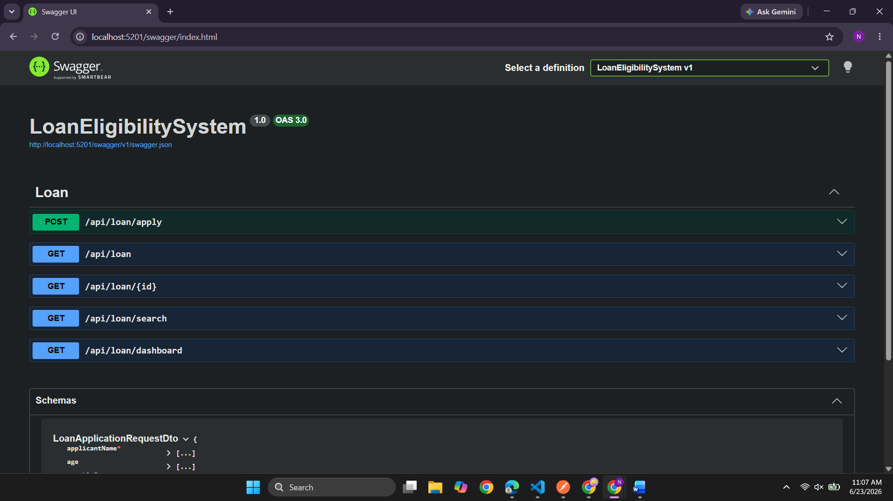
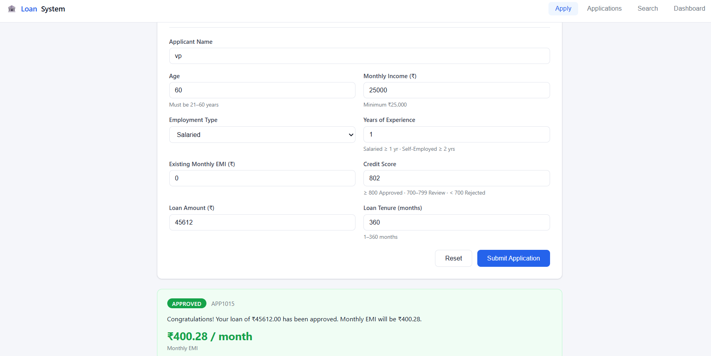
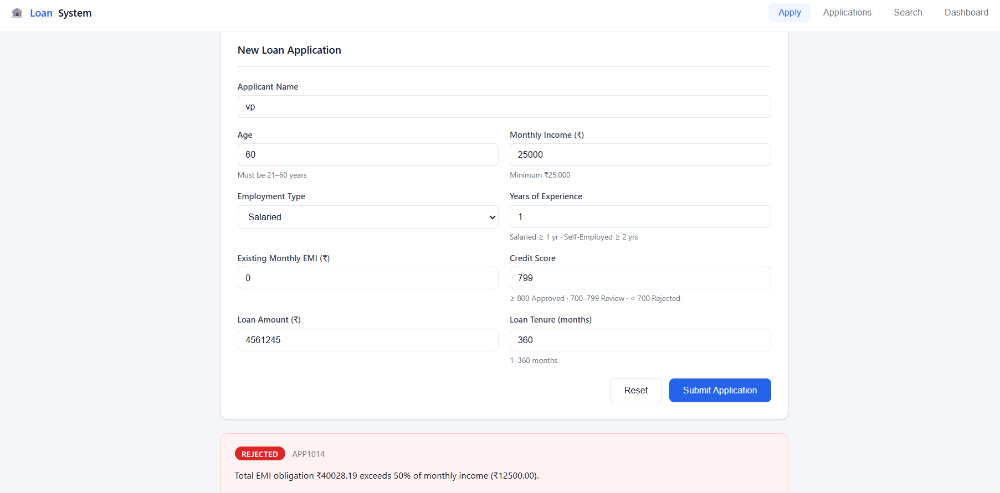
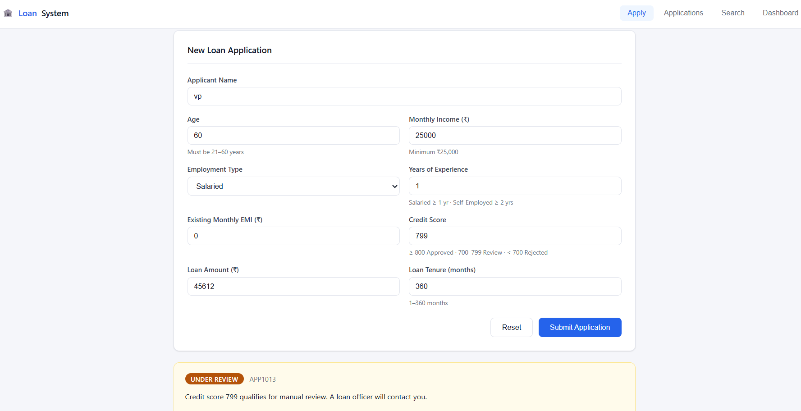
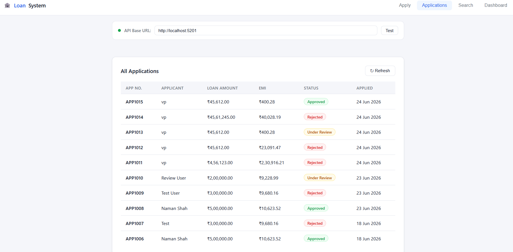
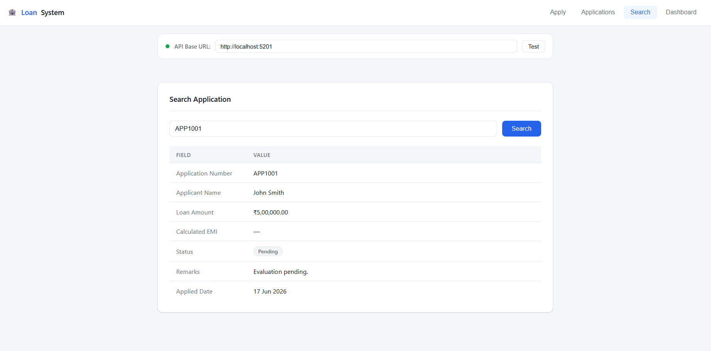
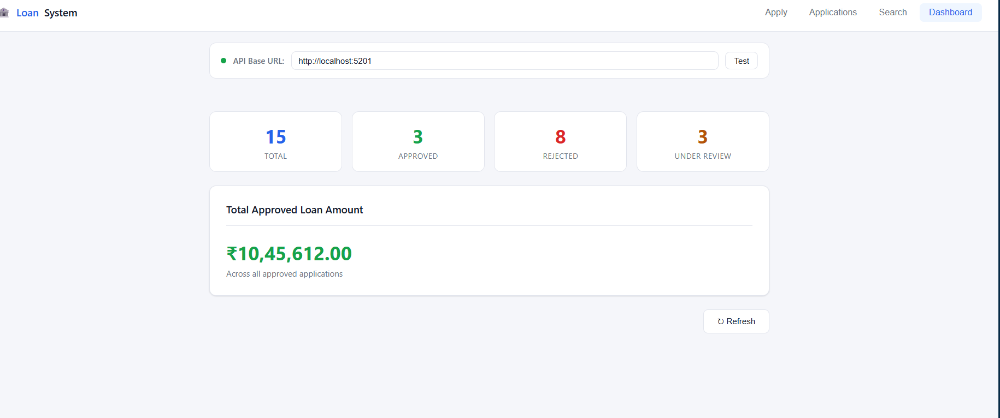

# Loan Eligibility & Approval System

A REST API built with **ASP.NET Core 8** that evaluates loan applications against 5 predefined business rules and automatically assigns a status: **Approved**, **Rejected**, or **Under Review**. Includes a lightweight HTML/CSS/JS frontend — no frameworks, no build step.

---

## Tech Stack

| Category | Technology |
|---|---|
| Backend | ASP.NET Core 8 Web API, C# |
| ORM | Entity Framework Core 8 (Code-First) |
| Database | SQL Server LocalDB |
| API Docs | Swagger / OpenAPI |
| Frontend | Plain HTML + CSS + JavaScript (single file) |

---

## Project Structure

```
LoanEligibilitySystem/
├── Controllers/      → API endpoints
├── Services/          → Eligibility engine, EMI calculator, business logic
├── Repositories/    → Database access layer (EF Core)
├── Models/            → EF Core entity
├── DTOs/               → Request and response contracts
├── Data/                → AppDbContext
├── Middleware/      → Global exception handling
├── Migrations/      → EF Core migration history
└── index.html        → Frontend (open directly in browser)
```

---

## Setup & Running

### Prerequisites
- .NET 8 SDK — https://dotnet.microsoft.com/download
- SQL Server LocalDB (comes with Visual Studio) or SQL Server Express
- EF Core tools: `dotnet tool install --global dotnet-ef`

### Steps

**1. Clone the repository**
```bash
git clone https://github.com/yourusername/LoanEligibilitySystem.git
cd LoanEligibilitySystem
```

**2. Configure connection string**

Open `appsettings.json` and set your SQL Server connection:
```json
"ConnectionStrings": {
  "DefaultConnection": "Server=(localdb)\\MSSQLLocalDB;Database=LoanEligibilityDb;Trusted_Connection=True;TrustServerCertificate=True;"
}
```

For SQL Server Express, use: `Server=.\\SQLEXPRESS`

**3. Create the database**
```bash
dotnet ef database update
```

**4. Run the backend**
```bash
dotnet run
```

The API starts on `http://localhost:5201` (http) and `https://localhost:7201` (https). The exact ports are printed in the terminal.

**5. Open the frontend**

Open `index.html` directly in your browser (double-click the file). Set the API Base URL in the top bar to match your http port (e.g. `http://localhost:5201`) and click **Test Connection** — the dot turns green when connected.

**6. Open Swagger (optional)**
```
https://localhost:{port}/swagger
```

---

## Using the Frontend

The frontend has 4 tabs:

| Tab | What it does |
|---|---|
| **Apply** | Fill the form and submit a loan application. Result shows instantly with status and EMI. |
| **Applications** | View all submitted applications in a paginated table. Change page size (5 / 10 / 20 / 50). Navigate with Prev / Next / page number buttons. |
| **Search** | Enter an application number (e.g. `APP1001`) to look up a specific application. |
| **Dashboard** | See aggregate counts — total, approved, rejected, under review — and total approved loan amount. |

> **API Base URL bar** — shown at the top of every page. If your backend runs on a different port, update it here and click Test Connection.

---

## API Endpoints

| Method | Endpoint | Description |
|---|---|---|
| `POST` | `/api/loan/apply` | Submit and evaluate a loan application |
| `GET` | `/api/loan` | Get all applications (returns full list) |
| `GET` | `/api/loan/{id}` | Get a specific application by database ID |
| `GET` | `/api/loan/search?applicationNo=APP1001` | Search by application number |
| `GET` | `/api/loan/dashboard` | Aggregate statistics by status |

### Sample Request — POST /api/loan/apply

```json
{
  "applicantName": "John Smith",
  "age": 30,
  "monthlyIncome": 60000,
  "employmentType": "Salaried",
  "experienceYears": 3,
  "existingEMI": 5000,
  "loanAmount": 500000,
  "loanTenure": 60,
  "creditScore": 820
}
```

### Sample Response

```json
{
  "applicationNumber": "APP1001",
  "applicantName": "John Smith",
  "loanAmount": 500000,
  "calculatedEMI": 10624.26,
  "status": "Approved",
  "remarks": "Congratulations! Your loan of ₹500000.00 has been approved. Monthly EMI will be ₹10624.26.",
  "appliedDate": "2026-06-24T10:30:00Z"
}
```

---

## Business Rules

| # | Rule | Condition | Result |
|---|---|---|---|
| 1 | Age | Must be 21–60 years | Outside range → Rejected |
| 2 | Income | Minimum ₹25,000/month | Below threshold → Rejected |
| 3 | Experience | Salaried ≥ 1 yr, Self-Employed ≥ 2 yrs | Below threshold → Rejected |
| 4 | Credit Score | ≥ 800 / 700–799 / < 700 | Approved / Under Review / Rejected |
| 5 | EMI Affordability | Existing EMI + New EMI ≤ 50% of income | Exceeds limit → Rejected |

Rules are evaluated in order — the first failing rule determines the rejection reason.

---

## Assumptions

- Annual interest rate is fixed at **10%** for EMI calculation
- EMI formula: `EMI = P × r × (1+r)^n / ((1+r)^n − 1)`
- Credit score valid range: **300–900**
- Application numbers auto-generated: APP1001, APP1002, ...
- `employmentType` accepts exactly: `Salaried` or `Self-Employed`


## API Screenshots

### Swagger UI Home


### POST /api/loan/apply — Approved


### POST /api/loan/apply — Rejected


### POST /api/loan/apply — Under Review


### GET /api/loan — All Applications



### GET /api/loan/search — By Application Number


### GET /api/loan/dashboard — Statistics


## Author

Naman — Backend Developer Intern